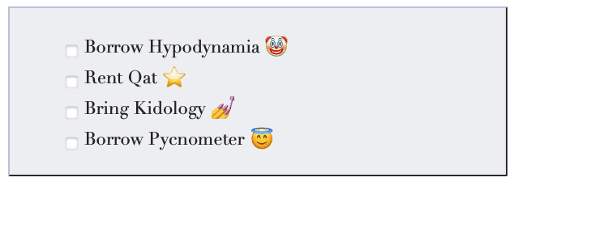

# DOM manipulator 🧪

A toy project to experiment with TypeScript, HTML and CSS:

## Setup

Install [npm](https://docs.npmjs.com/cli/) ([Volta](https://volta.sh) is recommended) then:

    npm install

## Run

Generate JavaScript code:

    npm run build-watch

Then directly open [index.html](./index.html) in your favorite web browser.

Note that you can also browse the page in HTTP via:

    npm run serve

## Test

Serve via HTTP:

    npm run serve

Then run end-to-end tests:

    npm run end-to-end-tests
